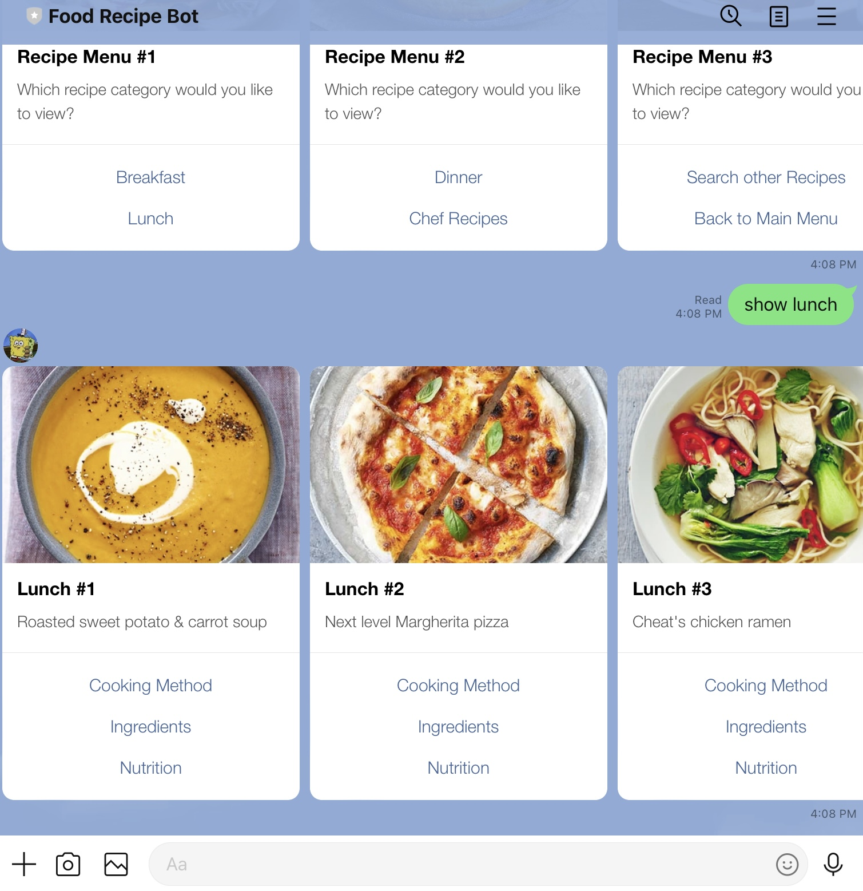
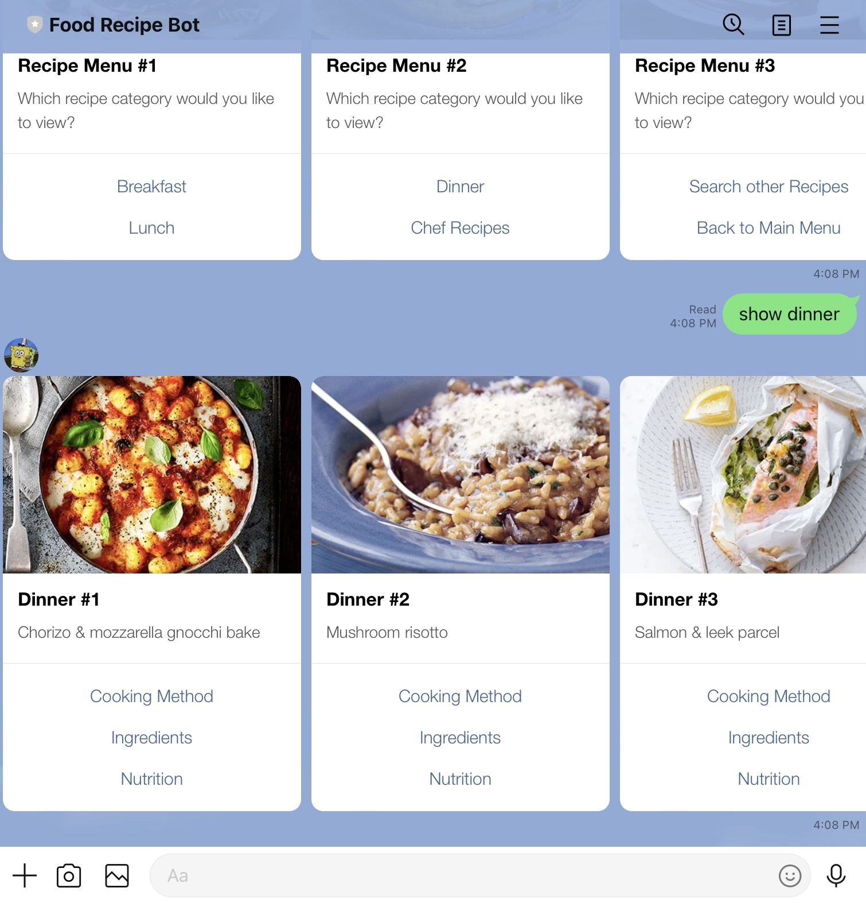

# Food Recipe Line Bot

#### A simple food recipe Line bot based on finite state machine
Created with [LineBotAPI](https://developers.line.biz/en/docs/messaging-api/overview/), [Flask](https://www.palletsprojects.com/p/flask/), [BeautifulSoup4](https://www.crummy.com/software/BeautifulSoup/bs4/doc/), and [pytransitions](https://github.com/pytransitions/transitions)

## Finite State Machine
This model is a representation of the FSM of the Line bot made with [pygraphviz](https://pypi.org/project/pygraphviz/)

# Features

**Navigation menus built with carousels and buttons for easier navigation**

### 3 Main Features!
- Browse existing recipes
- Search for new recipes
- Browse chefs

### Browse Existing Recipes
- Breakfast
- Lunch
- Dinner
- Chef Recipes

### Look Up Information for Each Individual Recipe
- Cooking method
- Ingredients needed to replicate
- Nutrition facts

## Deployment
Line bot deployed with [Heroku](heroku.com)

# Add the Bot!

# References
All related data used/scrapped comes from [BBC Good Food](https://www.bbcgoodfood.com/)
